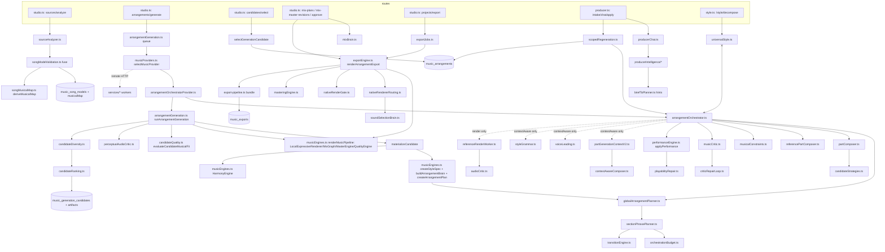

# Architecture map — user intent → exported audio (as it executes today)

Repository archaeology of `ws-main-live` (worktree at latest state), read-only. Paths below are relative to `artifacts/api-server/src/` unless they start with `lib/db`, `lib/api-spec`, `docs/` or `services/`. Every claim cites the file and line it was read from; anything not read is marked **not verified**.

Scope note: the production HTTP path (what a user can reach) is traced first; benchmark/tournament-only paths are named where they diverge, because several "Wave Q" capabilities exist only there.

---

## 1. The stage chain as it actually executes

### 1.0 Entry points (routes/studio.ts, routes/producer.ts)

The generation path a user reaches is `POST /projects/:projectId/sources` (`routes/studio.ts:1775`) → analysis, then `POST /arrangements/:arrangementId/generate` (`routes/studio.ts:2691`), `POST /generation-candidates/:id/select` (route at `routes/studio.ts:2857`–`2897`, body in `lib/arrangementGeneration.ts:2404`), `POST /projects/:id/mix-plans` (`routes/studio.ts:3718`), `POST /projects/:id/mix-master-revisions` (`:3524`), `.../approve` (`:3847`), `POST /projects/:id/export` (`:3924`). The conversation path is `routes/producer.ts:154–329` (intake / answers / chat / apply / explain). A standalone `POST /style/decompose` exists in `routes/style.ts:24` and is not connected to any of the above (see §2, UniversalStyle).

### 1.1 Source upload → analysis → Song Model + musical map

| | |
|---|---|
| Code | `lib/sourceAnalyzer.ts:1116 analyzeProjectSource(sourceId, attemptId)`; fusion at `:980` and `:2049` via `fuseProviderSongModels` (`lib/songModelValidation.ts`); reconciliation `reconcileAnalysisDomains` at `:1857`; Song Model row insert at `:1032` / `:2159`. |
| Input | project source (audio/MIDI) + provider results (`lib/analysisProviders.ts`, 2,499 lines; remote workers under `services/*-worker`). Local-only fallback is `LOCAL_SIGNAL_ANALYZER_V1` (`sourceAnalyzer.ts:973, 1547, 1585`). |
| Output | `SongModelData` (`lib/db/src/schema/music-studio.ts:1010`), with `musicalMap` (`SongModelMusicalMap`, `:716`) derived deterministically by `lib/songMusicalMap.ts:1148 deriveMusicalMap` → `deriveHarmony/Melody/Rhythm/Energy/Structure/StyleFingerprint/Vocals/ArrangementSpace` (`:174, 348, 479, 601, 648, 1032, 808, 951`). The map is attached during fusion at `lib/songModelValidation.ts:1370` and `:1546`. |
| Persists | `music_song_models` (`schema:1372`), `music_analysis_jobs`, `music_analysis_attempts`, `music_artifacts`. |
| Deterministic vs model | Local analyzer and the whole musical-map derivation are deterministic; ML lives only in remote workers (`services/`, 29 worker directories, ~49k Python lines). |
| Evidence | `SongModelData.reconciliation` (`DomainReconciliationReport`, `schema:990`), `fusion`, `validation`; `musicalMap.inputsDigestSha256` gives staleness (`songMusicalMap.ts:1180`). |
| Gate | `evaluateArrangementEligibility` (`lib/songModelValidation.ts:1575`) blocks generation on `status !== "ready"`, validation failure, `validation.status === "flagged"` (fields to confirm), or confidence `< MIN_ARRANGEMENT_CONFIDENCE`. |

### 1.2 Brief / conversation → planner hints (optional)

`routes/producer.ts:154–222` → `lib/producerChat.ts:424 createProducerChatService` → pure modules in `lib/producerIntelligence/` (`index.ts` re-exports `intentExtraction`, `styleResolution`, `styleResearch`, `clarification`, `briefCompiler`, `briefToPlanner`, `conceptGenerator`, `editPlan`, `explain`). The brief is reduced to biases by `lib/producerIntelligence/briefToPlanner.ts:40 briefPlannerHints(brief)` → `{ global: GlobalPlannerHints, section: SectionPlannerHints, evidence[] }` (energy/density multipliers clamped to 0.6–1.4 at `:32`, palette add/remove `:108–117`, climax `:88`, groove only when "grounded in the user's words" `:120–133`). Persisted in `music_production_briefs`, `music_producer_chat_turns`, `music_producer_brief_decisions` (`schema:4064–4110`). A model is involved only in `styleResearch.ts` / `openAiIntentModel.ts` when configured (documented in `docs/master-plan.md` "What already exists" table; the env gating itself **not verified** in this pass).

`queueArrangementGeneration` (`lib/arrangementGeneration.ts:786–812`) attaches to every job: `productionBriefId/Digest`, `plannerHints`, and `styleProfile` (brief's, else the owner's personal profile via `activePersonalProfile`, `:791`).

### 1.3 Job queue → provider selection

`queueArrangementGeneration` (`lib/arrangementGeneration.ts:676`): loads arrangement/project/song model/artifacts/tracks; `verifyProviderRegistry(createProviderRegistry())` then `selectMusicProvider` (`lib/musicProviders.ts:1883`) — filters on `available && checkpointReady && runtimeReady && healthStatus === "healthy" && providerRoutingAuthorized && tasks/speeds/hardware`, then `routeScore` (sorting at `:1912–1914`; `routeScore` body **not read**). The registry (`:2073–2091`) is every `providerDefinitions` entry as `HttpMusicGenerationProvider` plus `new LocalArrangementOrchestratorProvider()` and `new LocalArrangerModelProvider(...)`; the local brain is always healthy (`lib/arrangementOrchestratorProvider.ts:78–93`). Candidate count: `Math.max(1, Math.min(5, Math.round(input.candidates ?? 3)))` (`arrangementGeneration.ts:768`). Job row: `music_generation_jobs` (`schema:1525`) with `inputSnapshot` (song model snapshot, arrangement sliders, tracks, brief ref) and `parameters`. Execution is `setImmediate(runArrangementGeneration)` (`:1007`), recovery scheduler from `index.ts:103`.

### 1.4 Global plan → section/phrase plan → budget → transitions (inside the orchestrator)

`lib/arrangementOrchestratorProvider.ts:164 generate()` calls `orchestrateArrangement` (`lib/arrangementOrchestrator.ts:278`) with `render: false`, `now: new Date(0)`, `performanceStyle` from `parameters.styleProfile` (`performanceStyleFromProfile`, `lib/performanceEngine.ts:43`), `plannerHints` (brief hints override policy hints field-by-field, `:205–210`). **`contextAware` is never passed** by this provider, by `scopedRegeneration.ts:396`, or by any non-test caller (grep: only `contextAwareBenchmark.ts:82–88` and `tournamentProviders.ts` set it).

| Stage | Function | Reads | Writes | Notes |
|---|---|---|---|---|
| global plan | `lib/globalArrangementPlanner.ts:323 deriveGlobalArrangementPlan` | `musicalMap` (re-derived if stale, `:328–331`), `sections`, `reconciliation`, hints | `GlobalArrangementPlan` (`schema:2509`): style/substyle (`pickStyle :109` from palette hints + tempo band), palette (`buildPalette :142`; seeds drums/bass/keys when no instrumental family `:154–158`), per-section energy/density/tension/role/novelty (`:350–391`), climax (`:393–420`), groove/orchestration/motif/contrast/aesthetic pickers (`:189–290`), confidence (`:426–438`) | deterministic; digest `globalPlanInputsDigest :304` |
| section/phrase/role plan | `lib/sectionPhrasePlanner.ts:210 deriveSectionPhrasePlan` | global plan + map | `SectionPhrasePlan`: `sections` (active families = `2 + energy·(palette−2)` `:251–257`), `roleAssignments` (`assignRole :107`, register/voicing/articulation tables `:52–81`), `phrases` (2/4/8-bar units or map subphrases `:399–437`) | `leavesFamilies` is `[]` in both branches (`:432–435`) — never populated |
| orchestration budget | `lib/orchestrationBudget.ts:281 deriveOrchestrationBudget` | section plan + `arrangementSpace`/`vocals` | windows with `budgets{totalDensity, melodic, rhythmic, harmonic, register, spectral, attention}` and `instrumentAdjustments{densityMultiplier, registerShift, note}` (`:107–181`), `registerOccupancy` spans with resolutions (`:204–262`) | deterministic |
| transitions | `lib/transitionEngine.ts:225 deriveTransitionPlan` | targets, cadences, structure transitions, vocal phrases | `TransitionPlanSet` — kind/strength/approachBars/harmonicApproach/vocalSafe + `devices` (`selectDevices :76–201`) | deterministic |

The orchestrator assembles a synthetic `ArrangementPlan` with `sections: []`, `style: {}`, `hierarchy: {}` (`arrangementOrchestrator.ts:299–311`) — i.e. the legacy fields are empty stubs; only the Wave-1 layers are real here.

### 1.5 Part plan → candidates → part composition

**Part plan.** `lib/partComposer.ts:124 buildPartComposerPlan` — one `PartTask` per `(section, roleAssignment)` via `taskFor` (`:42–88`; a sung LEAD yields no task, `:53`), plus `INTRO`/`ENDING` tasks and one `TRANSITION` task per boundary with devices (`:155–183`); seeds are `sha256(fusion.selectedProvider:taskId:musicalMap digest)` (`:103`); `dependsOn` is computed (`:191–196`) but only used as a sort key — nothing waits on a dependency.

**Candidate plan.** `lib/candidateStrategies.ts:166 planCandidateGeneration` — 1–5 strategies from a fixed list (`candidateStrategySet :109`), each with a seed and `partAdjustments[{taskId, densityMultiplier, seed}]` (`:194–202`). The profile also carries `syncopationBias`, `counterMelodyEmphasis`, `harmonicAdventurousness`, `registerSpread`, `orchestrationSizeDelta`, `velocityHumanization` (`:51–102`); **none of these is read anywhere outside this file** (grep over `lib/` excluding tests: only `formSegmentation.ts`, `listeningRendererV2.ts`, `musicEngines.ts:550` use a same-named but unrelated `registerSpread`).

**Composition** (`arrangementOrchestrator.ts:370–416`): for each candidate, for each task in tier order:

1. `buildPartGenerationRequest(songModel, task, layers, existing)` (`lib/partComposer.ts:294`) builds a **V1** `PartGenerationRequest` (`:223–249`): `task, seed, instrument, role, section (SectionPlan), phrases, globalPlan, budgetWindows (filtered to the section), transitions (touching the section), context{previousBars,currentBars,nextBars}` = slices of the **source** `songModel.chords/melody/bass` with `CONTEXT_BARS = 2` (`:251, 331–333`), `existingParts = [{instrument, role, noteCount}]`, `styleFingerprint`, `constraints{playableRange, comfortableRange, maxLeap, maxSimultaneousNotes, minNoteDuration, physicalRules: string[]}` (`:341–348`, prose rules at `:282–292`).
2. `compose(request)` = `composeReferencePart(request, { tempoBpm, meter })` (`lib/referencePartComposer.ts:69`) unless a `composeParts` function was injected (`arrangementOrchestrator.ts:289–290`). No production caller injects one (only `arrangerTrainingPipeline.ts`, tests and the tournament).
3. `applyDensity(raw, adjustment.densityMultiplier)` (`arrangementOrchestrator.ts:219–235`): keeps `round(n·min(1,mult))` notes by even stride and scales velocity — **this is the entire effect of a "strategy" on the notes**, besides the seed.
4. Parts of the same instrument are merged into one track and de-duplicated (`:400–411`), then `trackModelFor` stamps `source: REFERENCE_PART_COMPOSER` and `cc: [], articulations: [], automation: []` (`:248–274`).

What the reference composer actually reads (`lib/referencePartComposer.ts`): `request.context.currentBars.chords` (`:80`), `request.section.{startBar,endBar,density,energy,registerDistribution}`, `request.budgetWindows[0].budgets.totalDensity` — **only the first window of the section** (`:100–104`), `globalPlan.grooveStrategy` (`:110, 117`), `transitions[].devices` for a drum fill (`:132–134`), `budgetWindows[].vocalAttention < 0.3` for counter-melody gaps (`:239`), `constraints` (`:86, 175`). It never reads `existingParts`, `phrases`, `styleFingerprint`, `previousBars/nextBars`, the melody, the bass, the key, `instrumentAdjustments`, `registerShift`, or the section's `leadRole`. Every part is written from chord roots/triads (`chordPitchClasses :37–48`, `voiceNear :51`) and a fixed pattern per task (`:108–299`); a section with no chords in range produces no BASS/KEYS/PAD/STRINGS notes, and empty tracks are dropped (`arrangementOrchestrator.ts:414`).

**Context-aware path (not in production).** When `contextAware` is true the orchestrator solves one voicing plan per song (`harmonyPlanFor :155`, first chord per bar only, via `lib/voiceLeading.ts:370 solveVoiceLeading`) and derives a `StyleGrammar` from the song's own fingerprint (`styleGrammarFor :189` → `lib/styleGrammar.ts:98`), then **after** V1 composition upgrades the request (`lib/partGenerationContextV2.ts:543 upgradePartGenerationRequest`, adding `siblingParts` with real notes, `vocalAttentionMap`, `motifMemory`, prev/next summaries, hard/soft constraints, `lockedMaterial`, `candidateStrategy`, `styleGrammar`, `harmonyPlan`) and runs `composeWithContext` (`lib/contextAwareComposer.ts:489`) = six filter passes over the already-written notes (remove locked time, apply harmony plan, yield to vocal, avoid sibling collisions, apply groove, enforce hard constraints). The composer never sees the V2 request; the context is a post-filter. The benchmark (`docs/evidence/context-aware-vs-reference-benchmark.json`) reports criticScore 74.56 → 74.0, harmonyScore unchanged, playabilityErrors 0 → 6.89 (later fixed, `context-aware-regression-fixed.json`).

### 1.6 Constraints

`lib/musicalConstraints.ts:546 checkArrangementConstraints` (per-family physical checks in `checkInstrumentConstraints :222`; guitar tunings `:67`, `fingerable :88`). Called pre-performance (`arrangementOrchestrator.ts:419`), per performed track (`:482`), and on the performed ensemble (`:523`); its `errorCount` sums into `constraintErrors` (`:570`). Also inside the critic's hard-rule gate (`lib/musicCritic.ts:121–139`) and the `playability` dimension (`:454–475`). Instrument limits come from `getInstrumentDefinition` (`lib/musicEngines.ts:390`; seven family branches — drums, bass/strings, brass, guitar, synth, keys — matched by substring of the instrument name, `:397–400`).

### 1.7 Critique (two critics, two vocabularies)

**Critic A — in the orchestrator, decides selection, not persisted.** `lib/musicCritic.ts:500 critiqueArrangement({songModel, plan, trackModels})` → `ArrangementCritique` (`schema:3570`): hard-rule gate (`:84–142`) + 11 weighted dimensions (`DIMENSION_WEIGHT :42–54`). Which dimensions look at the composed notes: `hardRule` (playability), `groove` (kick/bass lock only when a drums and a bass track exist, `:233–244`), `voiceLeading` (`:249–286`), `playability` (`:454`). Which judge only the **plan or the source song**: `harmony` reads `songModel.chords` confidence and `songModel.melody` vs source chords (`:148–198`) — it scores the *source*, not the arrangement; `leadCompatibility` reads `orchestrationBudget.windows[].instrumentAdjustments` (`:288–318`); `orchestration` (`:320–356`), `sectionDevelopment` (`:358–393`), `transitions` (`:432–452`), `performancePotential` (`:477–494`) read the plan; `motifCoherence`, `contrast` read the map (`:395–430`). Consequence: `overallScore` is close to candidate-invariant, which is what the baseline reports (`docs/master-plan.md:5858–5892`: `candidateDiversity ≈ 50.4 with almost no spread`, `sectionConsistency = 100`), and `harmonyScore 58.33` is a property of the corpus, not of any arrangement (`lib/arrangementBenchmark.ts:73–77` reads exactly this dimension). Note the predicate at `musicCritic.ts:302`: `["COUNTER_MELODY", "FILL", "CALL_RESPONSE"].some(() => a.densityMultiplier > 0.9) && a.densityMultiplier > 1` — the role list is never consulted (the callback ignores its element).

**Critic B — in the job runner, persisted, used for ranking.** `lib/candidateQuality.ts:1224 evaluateCandidateMusicalFit({songModel, plan, tracks, harmonyDecisions})` → `CandidateMusicCriticReportV2` (17 dimensions, `:1231–1248`), computed against the **legacy** plan from `materializeCandidate` (see §1.10). Audio: `lib/perceptualAudioCritic.ts:34 evaluateRenderedPcm` on the preview render. The orchestrator's `audioCritic.ts:146 critiqueRenderedAudio` (10 dims) and `abCompareCandidates` (`:370`) run only when `render !== false` — i.e. never in production (`arrangementOrchestratorProvider.ts:197`), so `finalScore = symbolic` (`arrangementOrchestrator.ts:575`).

### 1.8 Repair

`lib/criticRepairLoop.ts:214 runCriticRepairLoop({songModel, plan, trackModels})` is called at `arrangementOrchestrator.ts:429` **without an `applyRepair`**, so the default `applyPlanRepairs` (`:109–208`) runs: it `structuredClone`s the plan and edits it — adds a role assignment to a section (`:115–143`), adds a transition device (`:144–159`), lowers `densityMultiplier` under the vocal (`:160–172`), adds register resolutions (`:173–190`), shifts verse/chorus energies (`:191–198`) — and never touches `trackModels` (`default:` branch `:200–203`). Because Critic A scores mostly the plan, the re-critique rises; the loop reports `improved`. The orchestrator then keeps only `repair.finalCritique` (`:430`) and discards the repaired plan; the notes are unchanged; `initialCritique` is computed and voided (`:428, 577`). The persisted trace is the integer `repairPasses` (`arrangementOrchestratorProvider.ts:276`).

The other repair system, `lib/candidateRepair.ts:196 applyBoundedRepair`, is job-level: `queueCandidateRepair` (`arrangementGeneration.ts:2040`) queues a **new full generation** with `candidates = 1`, then verifies the proposal only changed notes/cc/articulations inside the finding's scope with permitted operations (`:207–252`); `MAX_REPAIR_ATTEMPTS = 2` (`:16`). It needs a `CriticRepairFinding` from the audio critic or a server-authored finding (`audioFindingToRepairFinding :22`). It is a scope verifier around regeneration, not a targeted rewrite.

### 1.9 Performance

`lib/performanceEngine.ts:259 applyPerformance` (`PERFORMANCE_ENGINE_V2`, `:27`): family profile (bass forced to plucked, `:266–267`), swing ratio / microtiming / dynamics from `performanceStyle` when present (`:271–284`), phrase-role gain (`:308–320`), chord clusters rolled/strummed, ghost notes, flams, CC arcs, breaths — returns `notes, cc, articulations, decisions[]` (`PerformedTrack :116`). The orchestrator keeps `notes, cc, articulations` (`arrangementOrchestrator.ts:471–473`) and **drops `decisions`**. Then `repairPlayability` (`lib/playabilityRepair.ts:85`) folds leaps/ranges, releases polyphony, truncates breaths (`:464–468`). `performanceEvidence` (`schema:2206`) is sealed with `performedMaterialSha256` (`:490–515`); `sectionRanges` is derived from `appliedDirectives`, which the orchestrator never sets, so it is `[]` (`:501`), and the export's equality check against the same empty list passes trivially (`lib/exportEngine.ts:872–880`). A second, legacy performance engine exists: `class PerformanceEngine` in `lib/musicEngines.ts:3335`, used only inside `buildTrackModels` (`:4356`) — the non-brain provider path.

### 1.10 Materialization in the job runner (the second planner)

Back in `runArrangementGeneration` (`lib/arrangementGeneration.ts:1012`), each provider candidate goes through `materializeCandidate` (`:350`): `createStyleSpec(arrangement.style, sliders, generationPreference)` (`lib/musicEngines.ts:508` — a `StyleSpec` from the free-text style string + sliders, with an embedded `StyleGrammar "1.0"` vocabulary derived by regex, `:520–535`), `buildArrangementBrain` (`musicEngines.ts:944`, the pre-Wave-1 section-arc planner), `createArrangementPlan` (`musicEngines.ts:1624` → `createArrangementPlanWithOrchestration` + `WithStyle`, then **`planningLayers` re-derives global/section/budget/transition/partComposer plans and a 5-candidate `candidateGenerationPlan` regardless of the requested count**, `:1697–1720`). Because the provider declares `materializesTrackModels: true` (`arrangementOrchestratorProvider.ts:75`), the notes pass through untouched (`arrangementGeneration.ts:489–491`); `HarmonyEngine().generate(songModel, plan)` runs again for `harmonyDecisions` (`:498`); `validateCanonicalTrackModels` rejects unplayable models (`:546`). The persisted `evaluatedPlan` is therefore the legacy plan + recomputed layers — not the plan the notes were composed from (the orchestrator's plan id is `orchestrated-<digest>`, `arrangementOrchestrator.ts:300`; it is discarded after `candidatePlan()` extracts section energy/density and a track list, `arrangementOrchestratorProvider.ts:116–132`).

### 1.11 Evaluation render (preview synth), MIDI, quality report

`renderMusicPipeline` (`lib/musicEngines.ts:4601`): `LocalExpressiveRenderer` per track, every track marked `rendererStatus: "preview-only"` with the fixed `fallbackReason` (`:4646–4653`), `MixGraph.mix` (`:4655`), `MasterEngine.process` (`:4656`), `QualityEngine.assess` (`:4657`, checks `silence/clipping/notePlayability/timing/sectionCoverage/lineage`, required at `arrangementGeneration.ts:1511–1533`). The runner writes `render.wav`, `performance.mid` (`createPerformanceMidi`, `lib/exportEngine.ts:487`), and `quality-report.json` (`arrangementGeneration.ts:1489–1560`), then the `CandidateEvaluation` (`schema:3787`) with `qualityReport`, `musicCritic` (v2), `audioCritic`, `strategy`, later `diversity`. The candidate's `parameters.candidateStrategy` is **overwritten** with the runner's own rotation `strategyForCandidate(index)` = `sparse|balanced|rhythmic|harmonic|orchestral` (`arrangementGeneration.ts:1280–1288`; `lib/candidateDiversity.ts:3–32`), while the brain's `conservative|rhythmic|melodic|sparse|adventurous` survives as `parameters.strategy` — two unrelated labels on one candidate.

Diversity guard (`arrangementGeneration.ts:1801–1822`): `fingerprintCandidate(evaluatedPlan, trackModels)` + `diversityEvidence`; near-duplicates become `diversity_rejected`; if only one survives, the job succeeds with `stage: "insufficient_diversity"` (`:1826–1850`). The live e2e evidence shows exactly this outcome for a 3-candidate run (`docs/evidence/orchestrator-live-e2e.json`: `"stage": "insufficient_diversity"`). Ranking: `rankEvaluatedCandidates` (`lib/candidateRanking.ts:319`) with owner calibration.

### 1.12 Selection → arrangement version

`selectGenerationCandidate` (`lib/arrangementGeneration.ts:2404`): requires `trackModels`, `evaluatedPlan`, `evaluatedStyleSpec`; inserts a new `music_arrangements` row (`:2507–2552`) with `sections: candidate.plan.sections` (the provider's small `CandidatePlan`, not the global plan), `plan: evaluatedPlan`, `styleSpec`, `trackModels`, `generationProvenance.evaluation`; updates `music_tracks` rows (`:2553–2568`); writes `ARRANGEMENT_PLAN` and `TRACK_MODEL` artifacts (`:2570–2600`). Editor edits go through `PATCH /arrangements/:id` (`routes/studio.ts:2418`) → `music_arrangement_revisions` (`schema:1506`), applied to notes only at mix/export time by `applyArrangementEditorChanges` (`lib/musicEngines.ts:4459`; `lib/exportJobs.ts:303–310`).

### 1.13 Revision by conversation (scope-aware regeneration)

`POST /producer/turns/:turnId/apply` (`routes/producer.ts:252`) → `regenerateWithinScopes` (`lib/scopedRegeneration.ts:373`): resolves the `EditPlan` to tracks and locks, then **runs the whole orchestrator on the whole song again** (`:396–403`, `render: false`, brief hints + performance style) and merges only the allowed scopes into the previous arrangement (`mergeCandidateIntoArrangement`, `:406–409`), ranks (`rankMergedCandidates :294`), verifies locks, and warns when every candidate reproduced the previous notes verbatim (`:419`). The regenerated part does not see the kept material (no `lockedNotes`/siblings reach the composer; `upgradePartGenerationRequest` is not on this path). Persisted as a new arrangement (`lib/scopedRegenerationDbStore.ts:74`) with `plan.regeneration: ScopedRegenerationReport` (`schema:3684`).

### 1.14 Mix → master → approve

`POST /projects/:id/mix-plans` (`routes/studio.ts:3718`) → `deriveMixPlan` (`lib/mixBrain.ts:133`) with **`styleProfile: null`** (`routes/studio.ts:3760`), so the style-driven branches (`:136–150`) never fire from this route; the plan is returned, not stored. `POST mix-master-revisions` (`:3524`) → `renderArrangementExport` (`lib/exportEngine.ts:639`) with `masterProfile: "STREAMING"` and the user's `MixMasterControls` → `applyMixMasterControls` (`:329`) → `music_mix_master_revisions` (`schema:1713`) with a preview artifact; `.../approve` (`:3847`). Mastering: `lib/masteringEngine.ts:222 masterAudio` (BS.1770 gated loudness, true-peak limiter, `MASTERING_METHOD :31`), profiles at `:52`.

### 1.15 Export (native render, gates, bundle)

`POST /projects/:id/export` (`routes/studio.ts:3924`) requires an approved revision (`:3953–3970`), allocates an `EXPORT` artifact and a production job; `runExportProductionJob` (`lib/exportJobs.ts:192`) verifies the approved preview bytes and snapshot (`:257–277`), requires `arrangement.plan && styleSpec` (`:294`), and re-renders through `renderArrangementExport` (`lib/exportEngine.ts:639`):

1. preview pipeline first (`:699–713`), `validateCanonicalTrackModels` (`:714–720`);
2. per track: `decideNativeRoute` (`lib/nativeRendererRouting.ts:110`; `PEDALBOARD_VST3` when the family is in the capability list, else sfizz family map); for pedalboard, `resolveTrackAsset` (`lib/soundSelectionBrain.ts:328` — operator table → catalogue scoring → refusal) reads `styleProfile` (`exportEngine.ts:777`); render via `pedalboardRenderer.renderAttested` / `sfizzRenderer.renderAttested` (`:805–817`), `validateNativeRenderSamples` (`:826`), `judgeNativeAgainstPreview` (`lib/nativeRenderGate.ts:66`, RMS-envelope plausibility, `:833`);
3. **on any failure the track falls back to the preview stem** (`fallback(...)`, `:749–760, 853`), and a native stem whose attestation/evidence does not hold is swapped back to preview (`nativeStemBlockers :893–910`);
4. mastering profile picks the tracks in the mix (`tracksForMasterProfile`, `:913–915`), `applyMixMasterControls` or `masterThroughEngine`, `QualityEngine.assess` (`:930–941`), `readinessReasons` (`:963–989`: every active track must be `licensed-native`, lineage complete, silence/clipping/playability/timing/coverage thresholds, single tempo/meter segment, phrase coordinates, per-track evidence);
5. `nativeQualityPassed = readinessReasons.length === 0` (`:990`) decides `production-ready` vs a labelled preview; bundle via `lib/export-pipeline.ts:837 createExportBundle` / `:206 persistExportBundle`.

Evidence persisted: `ExportRendererEvidence` (`exportEngine.ts:57`), `MasteringReport` (`schema:558`) with steps and excluded tracks, per-stem attestation (`RenderAttestation`, `schema:3509`), and the export manifest in `music_exports` (`schema:1696`).

---

## 2. Dependency graph, duplicated concepts, contradictions

### 2.1 Duplicated concepts (each pair runs, or exists, side by side)

| Concept | Instance 1 | Instance 2 (and 3) | Where they meet |
|---|---|---|---|
| Whole-song planner | Wave-1 layers: `globalArrangementPlanner.ts:323`, `sectionPhrasePlanner.ts:210`, `orchestrationBudget.ts:281`, `transitionEngine.ts:225` | Legacy `buildArrangementBrain` (`musicEngines.ts:944`) + `createArrangementPlanWithOrchestration/WithStyle` (`:1060`, `createArrangementPlan :1624`) producing `sections[].tracks/operations/trackDirectives`, `hierarchy`, `compositionIntelligence` | Both run on every orchestrator job (`arrangementGeneration.ts:384–402`); the legacy plan is what is persisted and exported; `planningLayers` (`musicEngines.ts:1697`) re-derives the Wave-1 layers into it, so two copies of the global plan exist per candidate with different `derivedAt`/ids |
| Section-function classifier | `classifySection` (`globalArrangementPlanner.ts:63`: `break` → `breakdown`) | `classify` inside `buildArrangementBrain` (`musicEngines.ts:966`: `breakdown|break` → `bridge`) | Same song gets two different function labels |
| Composer | `referencePartComposer.ts:69` (per part, chord-root patterns) | `CompositionEngine` (`musicEngines.ts:2195`, per track from `plan.sections[].tracks` operations) | `buildTrackModels` (`musicEngines.ts:4288`) uses the legacy composer for any provider that does not materialize track models; the brain bypasses it via `materializesTrackModels` |
| Performance engine | `applyPerformance` V2 (`performanceEngine.ts:259`) | `class PerformanceEngine` (`musicEngines.ts:3335`, called at `:4356`) | Two humanizers with different profiles and seeds |
| Harmony | `HarmonyEngine().generate` (`musicEngines.ts:1827`; run again in `materializeCandidate :498`) | `harmonyPlanFor` + `solveVoiceLeading` (`arrangementOrchestrator.ts:155`, `voiceLeading.ts:370`; contextAware only) | Neither reaches the reference composer; `harmonyDecisions` feed only Critic B (`candidateQuality.ts:1232`) |
| Style representation | `StyleSpec` (`schema:2170`; `createStyleSpec musicEngines.ts:508` from the style string + sliders; embeds schema `StyleGrammar "1.0"` `schema:2156`) | `StyleProfile` (`schema:3197`; `resolveStyleProfile styleResolution.ts:366`) → `performanceStyleFromProfile`, `soundSelectionBrain`, `mixBrain` | plus `styleGrammar.ts:65 StyleGrammar` (a *different* type from `schema:2156`, rule/directive based, contextAware only), `GlobalArrangementPlan.style` (`pickStyle :109`, a fingerprint-derived genre word), `UniversalStyle` (`universalStyleSchema.ts:19`; ~3.9k lines across `universalStyle*.ts`, reachable only from `routes/style.ts:24`), and the arrangement's free-text `style` column (`schema:1468`) that `createStyleSpec` regexes (`:514–519`) |
| Music critic | `musicCritic.ts:500` (11 dims, `ArrangementCritique`, decides the winner) | `candidateQuality.ts:1224` (17 dims, `CandidateMusicCriticReportV2`, persisted, ranks) | Different dimension sets, different weights, different plan inputs (orchestrator plan vs legacy plan) |
| Audio critic | `audioCritic.ts:146` (10 dims, stems + attestation; only when `render`) | `perceptualAudioCritic.ts:34` (PCM only; persisted) | In production only the second runs |
| Candidate strategy label | `CandidateStrategyId` `conservative|rhythmic|melodic|sparse|adventurous` (`candidateStrategies.ts:104`) | `CandidateStrategy` `sparse|balanced|rhythmic|harmonic|orchestral` (`candidateDiversity.ts:3–9`), also in `partGenerationContextV2.ts:458 candidateStrategy(seed)` | The runner overwrites `parameters.candidateStrategy` (`arrangementGeneration.ts:1286`) |
| Repair | `criticRepairLoop.ts` (plan-only edits, in-orchestrator, discarded) | `candidateRepair.ts` (scope verifier around a fresh 1-candidate generation) | Neither rewrites a flagged part in place |
| Renderer | `referenceRenderWorker.ts` (REFERENCE_SYNTH_V1, 48 kHz stems + attestation; benchmark/tests) | `LocalExpressiveRenderer` (`musicEngines.ts:3524`, evaluation + export fallback) | plus `listeningRendererV2.ts` (listening room) and the native `SfzRenderer`/`PedalboardRenderer` (`musicEngines.ts:3562/3646`) |
| Role vocabularies | `InstrumentArrangementRole` (`schema:2550`) | `OrchestrationRole` (`schema:2291`), `operationForTrack` strings (`musicEngines.ts:563–571`), `PartTask` (`schema:2719`) | Mapped by hand in `partComposer.ts:42–88` |
| Chord parsing / interval tables | `harmonyEngine.ts:123 CHORD_TEMPLATES`, `parseChordSymbol :491` | `referencePartComposer.ts:25–48`, `musicCritic.ts:58–78`, `musicEngines.ts:1740–1790 canonicalChordPitchClasses/legacyChordDetails`, `voiceLeading.ts:70 parseChordTones`, `harmonyMetrics.ts:353` … (18 files match the grep for `NOTE_ROOTS|[0, 3, 6]|[0, 4, 7]|CHORD_TEMPLATES|parseChordSymbol|parseChordTones|chordPitchClasses|chordTones(`) | Several disagree (e.g. `musicCritic.ts:72–76` has no `sus` case; `referencePartComposer.ts:40–46` does) |

### 2.2 Architectural contradictions

- The documented principle "source of truth = SongModel + ArrangementPlan + TrackModels + PerformanceData" (`docs/master-plan.md:14–16`) is met by the DB rows, but the `ArrangementPlan` persisted for a brain candidate is not the plan the notes were composed from (§1.10). The orchestrator's `plan` (`arrangementOrchestrator.ts:299–311`) is a stub with empty `sections/style/hierarchy` and is thrown away by the adapter (`arrangementOrchestratorProvider.ts:116–132, 267`).
- "Never accept the first attempt" (`candidateStrategies.ts:4`) — five candidates are the same composition thinned by stride (`arrangementOrchestrator.ts:219–235`) with a per-part seed that the reference composer uses only for a syncopated kick coin-flip (`referencePartComposer.ts:117`).
- "Critic → Repair loop … regenerates only the flagged scope" (`criticRepairLoop.ts:9–10`) — in the shipped path no notes are regenerated (§1.8).
- Wave Q's rule "the orchestrator already accepts an injected `composeParts`" (`docs/master-plan.md:5715`) is true, but the injected composer receives the V1 request (`arrangementOrchestrator.ts:385`) even on the context-aware path; V2 exists only as a post-filter (§1.5).
- The mix brain is designed to read a `StyleProfile` (`mixBrain.ts:135–147`) and the route hands it `null` (`routes/studio.ts:3760`).
- `traceable: stages.length === 11` (`arrangementOrchestrator.ts:635`) is bookkeeping: the context-aware path adds a 12th stage record (`:350`) and would report `traceable: false`.

### 2.3 What the part composer does NOT receive (global context lost at the local step)

From the V1 request (`partComposer.ts:223–249`) versus what the planners produced:

| Produced by the planners | Reaches the composer? |
|---|---|
| Sibling parts' notes (drums when writing bass, bass when writing keys) | No — `existingParts` is `{instrument, role, noteCount}` (`:239`); the reference composer never reads even that |
| Harmony plan / voicings (`voiceLeading.ts`) | No (contextAware post-filter only) |
| Key / mode (`songModel.keyMap`) | No field; the composer builds from chord symbols only (`referencePartComposer.ts:80`) |
| Source melody & bass in the window | In `context.currentBars.melody/bass` (`:277–278`) — never read by the reference composer |
| Previous/next section's composed material | No — `previousBars/nextBars` are source-model slices (`:331–333`) |
| Per-instrument budget adjustments (`densityMultiplier`, `registerShift`, "duck under the vocal") | Present in `budgetWindows[].instrumentAdjustments` but unread; only `windows[0].budgets.totalDensity` is used (`referencePartComposer.ts:100–104`) |
| Register-occupancy resolutions (`drop_octave`, `thin_voicing`) | Not in the request at all (`orchestrationBudget.registerOccupancy` is not passed; `layers` carries only `budgetWindows`, `arrangementOrchestrator.ts:332–336`) |
| `InstrumentRoleAssignment` details (`voicingStrategy`, `articulationFamily`, `dynamicShape`, `interactionWithLead`, `entryBar/exitBar`) | Only `role`, `instrument`, `startBar/endBar` survive into the `PartTask` (`partComposer.ts:143–153`) |
| Phrase plan (`role`, `energyTarget`, `entersFamilies`) | Passed as `phrases` (`:308`) — unread by the composer |
| Motif strategy / motif memory | `globalPlan.motifStrategy` passed, unread; motif memory only in V2 |
| Vocal phrases, breaths, lyrics | Only indirectly as `vocalAttention` per window |
| Candidate strategy semantics | Only the seed and a post-hoc density multiplier |
| Brief / StyleProfile / production aesthetic | `globalPlan.productionAesthetic` is passed and unread; the `StyleProfile` reaches only performance, sound selection, and (by design, not by the route) the mix brain |
| Locks / kept material (regeneration) | Not on this path (§1.13) |
| The instrument's `articulations`, `controls`, `directiveMappings` | Only range/leap/polyphony/minDuration and prose `physicalRules` (`:341–348`) |

---

## 3. One-shot paths and missing feedback loops

1. **Part composition is single-pass, no search.** One call per task (`arrangementOrchestrator.ts:385`); no per-part alternatives, no re-composition after constraints or critique; failures show up only as `constraintErrors` counts and the playability repair report (`:464–468`).
2. **Candidate "search" is a density transform.** §1.5 step 3; strategy biases unused (§1.5).
3. **Critique never feeds back into notes.** Critic A → plan-only repair → discarded (§1.8). Critic B and the perceptual audio critic only rank (`arrangementGeneration.ts:1464–1480, 1824`). The audio critic that produces `AudioMixAction`s (`audioCritic.ts:188–325`) never runs in production.
4. **No render-informed repair.** `render: false` in the provider (`arrangementOrchestratorProvider.ts:197`); the evaluation render happens after the notes are final; `queueCandidateRepair` restarts a whole generation and checks scope afterwards (`candidateRepair.ts:196`). Q-14 (listen → diagnose → repair → re-render) is planned, not built (`docs/master-plan.md:5843`).
5. **Selection is a single sort.** `feasible` then `finalScore` then id (`arrangementOrchestrator.ts:606–609`), with `finalScore = symbolic` in production; `abComparison` is `null` (`:600–604`).
6. **Repair by conversation recomposes the whole song.** `scopedRegeneration.ts:396–411`; the composer is blind to kept material; the code itself warns when all candidates are byte-identical (`:419`).
7. **Mix and master are one-shot and unmeasured against intent.** `deriveMixPlan` result is not persisted (`routes/studio.ts:3768`); the revision loop is manual (user posts controls, listens, approves); no automatic re-mix from the perceptual critic.
8. **Export degrades instead of iterating.** Native failures fall back to the preview stem and continue (`exportEngine.ts:749–760, 853, 899–910`); readiness becomes a label (`:963–990`), never a retry with a different asset or a repair of the offending track.
9. **Diversity is checked after the fact.** Near-duplicate rejection (`arrangementGeneration.ts:1801–1822`) can leave a 1-candidate result (`insufficient_diversity`), with no re-generation of a more distinct candidate.
10. **Planners never revise.** The four Wave-1 layers are derived once, top-down; nothing composed flows back into the section plan (the critic's `sectionDevelopment` complaint about identical repeats, `musicCritic.ts:371–380`, is answered only by the discarded plan repair).

---

## 4. Persistence and observability

**Inspectable afterwards**

| Decision | Where | Reference |
|---|---|---|
| Song Model, musical map, reconciliation, validation, trust | `music_song_models.model` | `schema:1372, 1010, 716, 990` |
| Job request (provider, sliders, brief ref, planner hints, style profile, generation preference), input snapshot | `music_generation_jobs.parameters / inputSnapshot` | `schema:1525`; written at `arrangementGeneration.ts:868–930` |
| Per-candidate: provider `CandidatePlan`, `trackModels` (with `performanceEvidence`), `evaluatedPlan` (legacy plan + Wave-1 layers + `partComposerPlan` + 5-candidate `candidateGenerationPlan`), `evaluatedStyleSpec`, `evaluation` (`qualityReport`, `musicCritic` v2 with per-dimension findings, `audioCritic`, `strategy`, `diversity`, `repair`) | `music_generation_candidates` | `schema:2068`; `arrangementGeneration.ts:1779–1800` |
| Candidate artifacts: `ARRANGEMENT_PLAN` (provider plan JSON), `AUDIO_TRACK` evaluation render, `MIDI`, `QUALITY_REPORT` JSON (provider score, runtime provenance, quality, both critics) | `music_artifacts` + object store `generation/<job>/<candidate>/…` | `arrangementGeneration.ts:1308–1345, 1608–1707` |
| Brain summary per candidate: `orchestratorVersion/method`, `composer`, `strategy`, `symbolicScore`, `hardRuleFeasible`, `constraintErrors`, `repairPasses`, `stages` (a comma string of `stage:status`), `traceable`, `performanceEngineVersion`, brief ref, `performanceStyleInputs` | `music_generation_candidates.parameters` | `arrangementOrchestratorProvider.ts:268–285` |
| Selected arrangement: plan, style spec, track models, `generationProvenance.evaluation`, artifacts `ARRANGEMENT_PLAN`/`TRACK_MODEL` | `music_arrangements`, `music_artifacts` | `arrangementGeneration.ts:2507–2600` |
| Editor revisions with summaries | `music_arrangement_revisions` | `schema:1506`; `lib/arrangementRevisions.ts:64` |
| Conversation: briefs (versions), turns, decisions, memory rules, `ScopedRegenerationReport` on the plan | `music_production_briefs`, `music_producer_chat_turns`, `music_producer_brief_decisions`, `music_producer_memory`; `plan.regeneration` | `schema:4064–4159, 3684` |
| Mix/master revision: controls, evidence, mastering report, preview artifact, approval | `music_mix_master_revisions` | `schema:1713, 558, 649` |
| Export: renderer evidence per stem, attestation, readiness reasons, manifest, bundle | `music_exports`, `music_artifacts` (EXPORT), object store | `exportEngine.ts:57, 963–1010`; `export-pipeline.ts:134–206` |
| Producer decisions, preference events, pairwise critic, personal profile, arranger policy versions | dedicated tables | `schema:1761, 405, 447, 488, 539` |

**Lost (computed, then dropped)**

| Decision | Computed at | Dropped at |
|---|---|---|
| Orchestrator `StageRecord[]` with evidence (climax bar, confidence, playability repair reports, notes per candidate) | `arrangementOrchestrator.ts:281–284, 312–330, 580–597` | reduced to `"plan:ok,parts:ok,…"` (`arrangementOrchestratorProvider.ts:228`) |
| Critic A `ArrangementCritique` per candidate (11 dimension scores, findings, `hardRuleFindings`, `recommendedRepairs`) | `:428–430` | only `overallScore`, `feasible`, first two strengths / first weakness survive as text (`arrangementOrchestratorProvider.ts:235, 248–265`) |
| `CriticRepairLoopResult.passes` (requests, applied operations, before/after scores) | `criticRepairLoop.ts:250–257` | only `passes.length` (`arrangementOrchestratorProvider.ts:276`) |
| The orchestrator's own `ArrangementPlan` (`partComposerPlan`, `candidateGenerationPlan` with the real seeds and `partAdjustments`) | `arrangementOrchestrator.ts:320, 327` | not persisted; `evaluatedPlan` recomputes layers with `count = 5` (`musicEngines.ts:1710`) |
| `PartGenerationRequest` per part and the raw vs thinned note counts | `:382–386` | never recorded |
| `PerformanceDecision[]` from V2 (`performanceEngine.ts:297`) | returned in `PerformedTrack` | not copied (`arrangementOrchestrator.ts:469–474`) |
| `initialCritique` (pre-repair) | `:428` | `void initialCritique` (`:577`) |
| Audio critique and A/B comparison | `:553, 600` | never computed in production (`render: false`) |
| Harmony plan / style grammar / context passes | `:341–362, 387–397` | never computed in production (`contextAware` unset) |
| Mix plan | `mixBrain.ts:133` | returned only (`routes/studio.ts:3768`) |
| Sound-selection reasoning per stem (`soundSelection.reason`) | `exportEngine.ts:781, 796` | present on `RenderedTrack` in memory; persistence into the export manifest **not verified** |

---

## 5. Status table

| Status | Item | Evidence |
|---|---|---|
| Works well | Job/lease/idempotency machinery, cancellation, recovery | `arrangementGeneration.ts:676–1010, 1012–1100, 2113–2229`; `index.ts:103–116` |
| Works well | Song Model contract, validation, eligibility gate that names the fields to confirm | `songModelValidation.ts:1575–1640`; 1,642 lines with 30 tests (`docs/master-plan.md:104`) |
| Works well | Deterministic musical map and Wave-1 planners with input digests and staleness | `songMusicalMap.ts:1122–1195`; `globalArrangementPlanner.ts:304–316, 463`; `sectionPhrasePlanner.ts:190–208, 451`; `orchestrationBudget.ts:268, 306`; `transitionEngine.ts:207, 310` |
| Works well | Instrument constraint engine and post-performance playability repair (benchmark `playabilityErrors` 0) | `musicalConstraints.ts:222–579`; `playabilityRepair.ts:85`; `docs/master-plan.md:5869` |
| Works well | Performance V2 with style inputs and per-note decisions | `performanceEngine.ts:259–330` |
| Works well | Export attestation chain: native-vs-preview plausibility gate, per-stem evidence, readiness reasons, mastering report | `exportEngine.ts:826–910, 963–1010`; `nativeRenderGate.ts:66`; `masteringEngine.ts:222` |
| Works well | Brief → planner hints with per-hint evidence lines | `briefToPlanner.ts:40–150` |
| Partially implemented | Candidate generation: distinct strategy profiles exist, only `densityMultiplier` + seed act | `candidateStrategies.ts:51–102, 194–202`; `arrangementOrchestrator.ts:386`; grep (§1.5) |
| Partially implemented | Music Critic A: 4 of 11 dimensions read notes; the rest read the plan or the source | `musicCritic.ts:148–198 (harmony reads songModel.chords/melody), 288–318, 320–356, 358–393, 432–452` |
| Partially implemented | Context-aware V2 request: built, benchmarked, off in production, applied as a post-filter | `partGenerationContextV2.ts:543`; `contextAwareComposer.ts:489–518`; `arrangementOrchestrator.ts:132, 387–397`; `docs/evidence/context-aware-vs-reference-benchmark.json` |
| Partially implemented | Harmony plan (voice-leading solver): one chord per bar, contextAware only, never reaches the composer | `arrangementOrchestrator.ts:144–178`; `voiceLeading.ts:370` |
| Partially implemented | Style grammar from fingerprint: derived and wired only on the contextAware path; different type from schema `StyleGrammar` | `styleGrammar.ts:65, 98, 285`; `schema:2156`; `docs/evidence/style-grammar-wired-live.json` |
| Partially implemented | Scope-aware regeneration: locks honoured, but composition is whole-song and blind to kept material | `scopedRegeneration.ts:396–420` |
| Partially implemented | Mix brain reads a StyleProfile; the route passes `null` | `mixBrain.ts:135–147`; `routes/studio.ts:3760` |
| Partially implemented | Performance evidence `sectionRanges`: always `[]` from the brain, check passes trivially | `arrangementOrchestrator.ts:501`; `exportEngine.ts:872–880` |
| Shortcut / fake intelligence | Critic→repair loop "improves" the score by editing a plan copy the critic reads, writes no notes, and the plan is then discarded | `criticRepairLoop.ts:109–208, 245–247`; `arrangementOrchestrator.ts:429–430, 577` |
| Shortcut / fake intelligence | `leadCompatibility` over-playing test ignores the role list: `["COUNTER_MELODY", "FILL", "CALL_RESPONSE"].some(() => a.densityMultiplier > 0.9) && a.densityMultiplier > 1` | `musicCritic.ts:300–304` |
| Shortcut / fake intelligence | Reference composer uses one budget window per section and ignores `instrumentAdjustments`, melody, bass, phrases, siblings | `referencePartComposer.ts:100–104` and the `switch` at `:108–299` |
| Shortcut / fake intelligence | `harmonyScore` benchmark metric is Critic A's `harmony` dimension, computed from the source song, so it cannot move with the arrangement | `arrangementBenchmark.ts:73–77`; `musicCritic.ts:148–198` |
| Shortcut / fake intelligence | `sectionConsistency` counts plan novelty values in a band (`n >= 0.1 && n <= 0.9`) — plan bookkeeping, as the plan itself admits | `arrangementBenchmark.ts:55–64`; `docs/master-plan.md:5879–5881` |
| Shortcut / fake intelligence | Candidate strategy label overwritten by an unrelated rotation | `arrangementGeneration.ts:1280–1288`; `candidateDiversity.ts:3–32` |
| Shortcut / fake intelligence | Export "production-ready" is decided by falling back per track and then labelling, rather than by fixing the failing stem | `exportEngine.ts:749–760, 853, 899–910, 990` |
| Shortcut / fake intelligence | `phrases[].leavesFamilies` is empty in both branches; `dependsOn` computed but never awaited | `sectionPhrasePlanner.ts:431–435`; `partComposer.ts:191–200`; `arrangementOrchestrator.ts:380` |
| Shortcut / fake intelligence | `planningLayers` always plans 5 candidates into the persisted plan regardless of the job's count | `musicEngines.ts:1710` |
| Unused infrastructure (in the generation path) | UniversalStyle parser/grammar/instructions (~3,944 lines) reachable only from `POST /style/decompose` | `universalStyle.ts`, `universalStyleSeed.ts`, `universalStyleLexicon.ts`, `universalStyleSchema.ts`; `routes/style.ts:24`; grep (§1.0) |
| Unused infrastructure | `audioCritic.ts` mix actions and `abCompareCandidates`; `referenceRenderWorker.ts` 48 kHz attested stems — benchmark/tests only | `arrangementOrchestrator.ts:535–557, 600–604` with `render: false` at `arrangementOrchestratorProvider.ts:197` |
| Unused infrastructure | `StyleSpec.grammar` vocabulary (`groove/voicing/…`) produced by regex from the style string; consumed by the legacy composer/mix only | `musicEngines.ts:520–535`; `buildTrackModels :4343–4351` |
| Unused infrastructure | `PerformanceDecision[]`, `describePasses`, `V2 lockedMaterial/productionBriefRef/candidateCount` slots (never passed) | `performanceEngine.ts:297`; `contextAwareComposer.ts:522`; `arrangementOrchestrator.ts:388–392` |
| Unused infrastructure | Tournament / model-discovery stack (CA2, Anticipatory MT, conditioning map, symbolic provider adapter) — evaluation harness, no production provider | `tournamentProviders.ts:36–160`; `symbolicGenerationProvider.ts`; `composersAssistantClient.ts`; `anticipatoryClient.ts`; `conditioningMap.ts` |
| Unused infrastructure | `YOUR_ARRANGER_MODEL` provider is shadow-only with a neutral policy | `arrangerModelProvider.ts:1–37`; `musicProviders.ts:173–176, 1911`; `docs/master-plan.md:78–81` |

---

## 6. Size of the code and where theory lives

**God-files (non-test, lines):** `lib/musicEngines.ts` 5,402 (instrument definitions, StyleSpec, legacy brain/planner, `HarmonyEngine`, `CompositionEngine`, `ModulationEngine`, `VoiceLeadingEngine`, legacy `PerformanceEngine`, `SoundLibraryRegistry`, `LocalExpressiveRenderer`, `SfzRenderer`, `PedalboardRenderer`, `MixGraph`, `QualityEngine`, `MasterEngine`, `buildTrackModels`, `applyArrangementEditorChanges`, `renderMusicPipeline`, voicing metrics, motif lineage — export list at `:34–5372`); `routes/studio.ts` 4,486 (78 route handlers); `lib/db/src/schema/music-studio.ts` 4,285; `lib/musicProviders.ts` 2,802; `lib/arrangementGeneration.ts` 2,668; `lib/sourceAnalyzer.ts` 2,657; `lib/analysisProviders.ts` 2,499; `lib/harmonyEngine.ts` 1,815; `lib/songModelValidation.ts` 1,642; `lib/songMusicalMap.ts` 1,496; `lib/universalStyle.ts` 1,431; `lib/exportEngine.ts` 1,318; `lib/candidateQuality.ts` 1,267; `lib/producerIntelligence/styleResearch.ts` 1,245; `lib/producerChat.ts` 1,202; `lib/conditioningMap.ts` 1,145; `lib/export-pipeline.ts` 1,035.

**The brain proper is small:** `arrangementOrchestrator.ts` 637, `globalArrangementPlanner.ts` 470, `sectionPhrasePlanner.ts` 459, `orchestrationBudget.ts` 313, `transitionEngine.ts` 318, `partComposer.ts` 385, `referencePartComposer.ts` 325, `candidateStrategies.ts` 225, `musicCritic.ts` 580, `criticRepairLoop.ts` 277, `candidateRepair.ts` 779, `musicalConstraints.ts` 579, `performanceEngine.ts` 634, `partGenerationContextV2.ts` 592, `contextAwareComposer.ts` 526, `voiceLeading.ts` 495, `styleGrammar.ts` 307, `arrangementOrchestratorProvider.ts` 299 — about 8,200 lines, versus ~5,400 in `musicEngines.ts` alone for the legacy path it was meant to replace.

**Other totals:** 151 test files / 31,664 lines under `lib/`; `lib/api-spec/openapi.yaml` 7,750 lines with 438 component schemas (all Wave-1 plan types, both critic reports, `ScopedRegenerationReport`, `StyleProfile`, `ProductionBrief` are in the contract — `openapi.yaml:4443–7351`); `docs/master-plan.md` 6,093 lines; `services/` 29 worker directories, ~49k Python lines (largest: `music-ai-worker/app.py` 1,846, `music-ai-gpu-worker/app.py` 1,150, `vst3-render-worker/host.py` 580).

**Where music-theory rules are scattered:**

- Chord spelling / interval tables in 18 files (grep in §2.1): `referencePartComposer.ts:25–48`, `harmonyEngine.ts:76–160, 491–559`, `musicEngines.ts:1733–1790`, `harmonyMetrics.ts:353`, `songModelValidation.ts`, `musicCritic.ts:58–78`, `harmonyGold.ts`, `conditioningMap.ts`, `analysisGoldSynthetic.ts`, `symbolicCorruptions.ts`, `partJudge.ts`, `analysisGold.ts`, `voiceLeading.ts:70`, `songMusicalMap.ts`, `songModelCorrection.ts`, `planningSupervision.ts`, `chordsFromNotes.ts`, `analysisProviders.ts`.
- Section-function regexes: `globalArrangementPlanner.ts:63–74` and `musicEngines.ts:966–975` (disagree on `break`).
- Instrument-family conventions: `sectionPhrasePlanner.ts:52–81` (aliases, tiers, registers, articulation, voicing), `orchestrationBudget.ts:34–44` (bands, flexibility), `globalArrangementPlanner.ts:134–140` (`ROLE_TIER`), `partComposer.ts:91–97` (`TASK_TIER`) and `:282–292` (prose physical rules), `musicEngines.ts:390–508` (`getInstrumentDefinition` numeric limits), `musicalConstraints.ts:67–88` (tunings, fingering), `performanceEngine.ts` `FAMILY_PROFILES` (referenced at `:267`; table **not read**), `exportEngine.ts`/`nativeRendererRouting.ts:15` (`PLATFORM_FAMILIES`).
- Role semantics: `sectionPhrasePlanner.ts:107–160` (`assignRole`, `ROLE_ACTIVITY`), `orchestrationBudget.ts:141–171` (role → ducking), `partComposer.ts:42–88` (role → task), `musicEngines.ts:563–571` (`operationForTrack`), `criticRepairLoop.ts:107–139` (`COLOUR_LAYERS`).
- Groove/swing: `globalArrangementPlanner.ts:189–214`, `referencePartComposer.ts:110–128`, `performanceEngine.ts:273–276`, `styleGrammar.ts` swing directive, `musicEngines.ts:520–522, 549` (`StyleSpec.rhythm`), `briefToPlanner.ts:34–38`.
- Transition devices: `transitionEngine.ts:76–201` (selection) and `referencePartComposer.ts:132–142, 262–272` (only `drum_fill` and a generic 3-note pickup are ever realized).

---

## Hot spots the redesign must address (≤10)

1. **Two planners per job; the persisted plan is not the composed plan.** `arrangementGeneration.ts:384–402` + `musicEngines.ts:1624–1720` versus `arrangementOrchestrator.ts:294–330`; adapter drops the brain's plan at `arrangementOrchestratorProvider.ts:116–132, 267`.
2. **The part composer is blind to everything but chords of the current bars and a density number.** `partComposer.ts:223–249, 331–348`; `referencePartComposer.ts:80, 100–104`; V2 context exists only as a post-filter, `arrangementOrchestrator.ts:387–397`.
3. **Repair writes no notes and is discarded.** `criticRepairLoop.ts:109–208, 245–247`; `arrangementOrchestrator.ts:429–430, 577`.
4. **Critic A judges the plan and the source, so it cannot rank candidates; benchmark `harmonyScore` is a corpus constant.** `musicCritic.ts:148–198, 288–318, 320–494`; `arrangementBenchmark.ts:55–77`.
5. **Candidates are one composition thinned five ways; strategy biases are dead fields; two strategy vocabularies collide.** `candidateStrategies.ts:51–102`; `arrangementOrchestrator.ts:219–235, 386`; `arrangementGeneration.ts:1280–1288`.
6. **Render and audio critique are switched off where users generate; nothing render-informed reaches composition.** `arrangementOrchestratorProvider.ts:197`; `arrangementOrchestrator.ts:535–557, 575, 600–604`; `exportEngine.ts:749–760, 899–910`.
7. **Four style representations plus a fifth, disconnected one; the mix brain gets `null`.** `musicEngines.ts:508–557`; `schema:2156–2183, 3197`; `styleGrammar.ts:65`; `universalStyle.ts` via `routes/style.ts:24` only; `routes/studio.ts:3760`.
8. **The brain's own trace is reduced to a string.** `arrangementOrchestrator.ts:281–284, 580–597` → `arrangementOrchestratorProvider.ts:228, 268–285`; `PerformanceDecision[]` dropped at `arrangementOrchestrator.ts:469–474`.
9. **Regeneration by conversation recomposes the whole song blind to kept material.** `scopedRegeneration.ts:396–420`.
10. **Theory tables and family conventions are duplicated across ≥18 files with disagreements.** Chord tables (§6 list); section classifiers `globalArrangementPlanner.ts:63` vs `musicEngines.ts:966`; family tables in `sectionPhrasePlanner.ts:52–81` / `orchestrationBudget.ts:34–44` / `partComposer.ts:91–97, 282–292` / `musicEngines.ts:390–508`.
